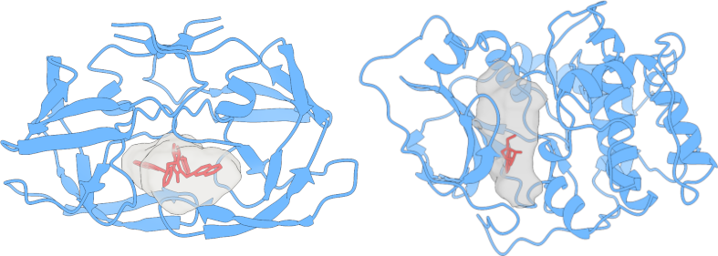

<h2 align="center"> Welcome to the Computational Biology Laboratory! 👋</h2>

  
  
  

</img>

  The Computational Biology Laboratory (<a href="https://lnbio.cnpem.br/thematic-programs/bioinformatics/">LBC</a>) is a cutting-edge laboratory housed within Brazilian Biosciences National Laboratory (<a href="https://lnbio.cnpem.br">LNBio</a>) at the Brazilian Center for Research in Energy and Materials (<a href="https://cnpem.br">CNPEM</a>) in Campinas/SP, Brazil. The LBC is committed to developing and applying advanced computational tools to solve complex biological problems, with a focus on structural biology, omics, and artificial intelligence in biology.
  
  Our multidisciplinary scientific team utilizes state-of-the-art technologies to analyze large datasets, investigate complex biological systems and develop innovative solutions to tackle some of the most challenging biological questions in the intersection of biology and computer science. With a deep commitment to excellence and a passion for innovation, the LBC is making significant contributions to the scientific community and driving the field of computational biology forward.

<h3 align="left">🌟 Featured Repositories</h3>

  
  
  
  

<h3> &nbsp;Featured publications </h3>

  <ul>
    <li> Guerra, J. V. da S., Ribeiro-Filho, H. V., Jara, G. E., Bortot, L. O., Pereira, J. G. de C., & Lopes-de-Oliveira, P. S. (2021). pyKVFinder: an efficient and integrable Python package for biomolecular cavity detection and characterization in data science. In BMC Bioinformatics (Vol. 22, Issue 1). Springer Science and Business Media LLC. https://doi.org/10.1186/s12859-021-04519-4.</li>
    <li> Guerra, J. V. da S., Ribeiro Filho, H. V., Bortot, L. O., Honorato, R. V., Pereira, J. G. de C., & Lopes-de-Oliveira, P. S. (2020). ParKVFinder: A thread-level parallel approach in biomolecular cavity detection. In SoftwareX (Vol. 12, p. 100606). Elsevier BV. https://doi.org/10.1016/j.softx.2020.100606.</li>
    <li> Oliveira, S. H., Ferraz, F. A., Honorato, R. V., Xavier-Neto, J., Sobreira, T. J., & de Oliveira, P. S. (2014). KVFinder: steered identification of protein cavities as a PyMOL plugin. In BMC Bioinformatics (Vol. 15, Issue 1). Springer Science and Business Media LLC. https://doi.org/10.1186/1471-2105-15-197.</li>
  </ul>

<h3> &nbsp;Scientific Team </h3>

  <ul>
    <li>Dr. Paulo S. Lopes-de-Oliveira (Coordinator) - <a href="https://github.com/psloliveira">@psloliveira</a></li>
    <li>Dr. José Geraldo de Carvalho Pereira - <a href="https://github.com/zgcarvalho">@zgcarvalho</a></li>
    <li>Dr. Helder Veras Ribeiro Filho- <a href="https://github.com/helder-ribeiro">@helder-ribeiro</a></li>
    <li>Dr. Gabriel Ernesto Jara - <a href="https://github.com/gabrieliacc">@gabrieliacc</a></li>
    <li>Dr. Leandro Oliveira Bortot - <a href="https://github.com/Leandro-OBt">@Leandro-OBt</a></li>
    <li>MSc. João Victor da Silva Guerra - <a href="https://github.com/jvsguerra">@jvsguerra</a></li>
  </ul>

